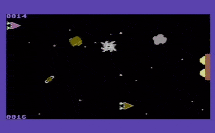
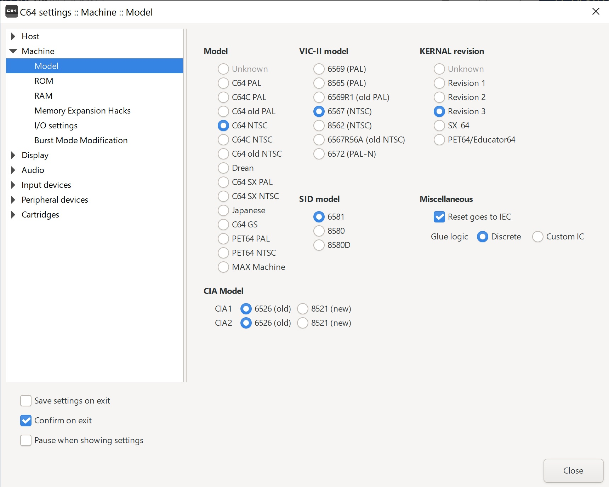
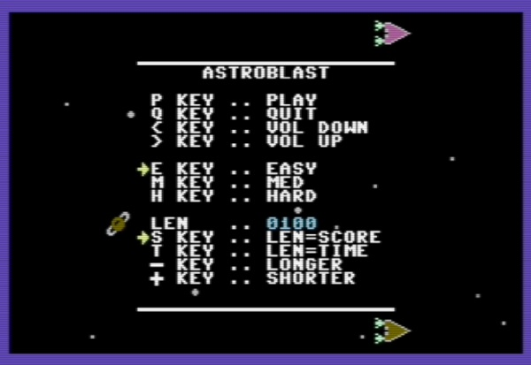
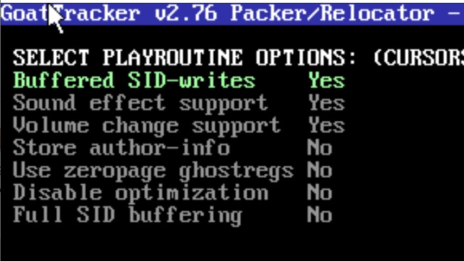
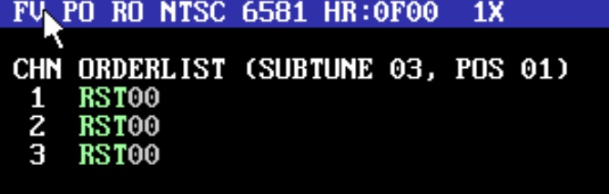
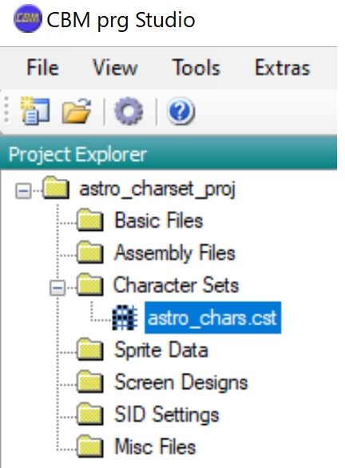

# astroblast 
This is a mini game created to explore possibilities of game programming on the Commodore 64.  This game is written entirely in 6502 assembly language.  Game specific code is in the root astroblast directory but code of a utility nature that could be used in other games was separated and put in the [nv_c64_util](https://github.com/nealvis/nv_c64_util) directory where you will find lots of code and macros that are not specific to this program.  Also, in the [nv_c64_util_test](https://github.com/nealvis/nv_c64_util_test) repository you will find test programs for this utility code. This game was intended to be run on an NTSC version of C64.  If running within an emulator such ase VICE you will want to configure it as such.  It seems to run fine in PAL mode but as you would expect everything runs a little slower.

## Overview
All the assembler code in this directory is written for Kick Assembler and in general the setup outlined in the [main repository README.md](../README.md).
This program is a mini C64 game that uses the nv_c64_util code for various functionality.  When the game is running it looks something like this. 

## Software Dependencies
There are no dependencies on libraries or game frameworks other than the [nv_c64_util](https://github.com/nealvis/nv_c64_util) companion repository.

## Building
To build the code in this repo you need you will need a development environment that includes the tools in the [env_setup.md](./env_setup.md) of this repo. You will also need to have the code from the nv_c64_util repository available and in a directory that is at the same level as the astroblast directory.  To prepare your build environment in this way you can follow these instructions.
1. **Setup build tools/environment** per the instructions here: [env_setup.md](./env_setup.md)
2. **Create empty directory** on your development machine, we'll call it BASEDIR
3. **Change dir to BASEDIR** in a git capable shell on your 
3. **Clone the nv_c64_utils** dependecy repo into BASEDIR with this command `https://github.com/nealvis/nv_c64_util.git`
4. **Clone the astroblast** repository repo while still in BASEDIR with this command `https://github.com/nealvis/astroblast.git`
5. **Build astroblast from VS Code** by opening the astroblast directory in VS Code and then open the file astroblast.asm.  With the kick assemebler IDE Extension installed per the [env_setup.md](./env_setup.md) in the root directory of this repository you press F6 and the Extension will call kickassembler appropriately for all the files needed and produce astroblast.prg which is a C64 program file that can be loaded an run on a real Commodore 64 or in the VICE C64 emulator.

The product of the build is the single C64 program file **astroblast.prg** which will exist in the astroblast directory.

## Running Astroblast
If running in the VICE emulator be sure that the emulator is set to NTSC.  You can do this by selecting **Settings** from the menu, then **Machine** and **Model**.  In this window you can select the settings shown in this screen shot:

To run astroblast in VICE it can be passed as the single argument on the commandline like this: **`x64sc.exe astroblast.prg`**

Alternatively if you would like to run it on a real C64 you can copy the file to a floppy disk (or SDCard if running an sd2iec device) and load it as normal with `load "astroblast.prg",8` followed by `Run` to execute after its loaded.

## Game Play
This is a two player game.  There is no one player mode.  The object of the game is to collect more asteroids than the other player before the time runs out or the target number of asteroids has been collected.  Both options of playing for a duration vs number of asteroids and the game ending number of seconds or asteroids collected can be set in the opening title screen

Other options on the title screen include the following keys:
- `<` key: Turns the game master volume down
- `>` key: Turns the game master volume up
- `E` key: Sets difficulty mode to Easy
- `M` key: Sets difficulty mode to Medium
- `H` key: Sets difficulty mode to Hard
- `S` key: Sets the length of the game to end when Score is reached
- `T` key: Sets the length of the game to end when Time is reached
- `-` key: Decreases the length of the game.
- `+` key: Increases the length of the game

To play this game both joysticks are used.  Joystick 1 controls the ship on the top of the screen as it moves left to right and joystick 2 controls the bottom ship.  Both ships are always moving forward unless pushed back by some solar wind in the game.  Players control the speed at which the ships move though.  

There is a Turret on the far right of the screen halfway down.  This turret has two guns, one shoots up and the other shoots down.  The turret can only shoot while its armed.  Players can see that the turret is armed and about to shoot because the guns will be flashing yellow and white.  While the turret is armed either player can force it to fire by pressing the joystick fire button and only the gun pointed at the other player will shoot. If neither player fires while the turret is armed, it will eventually fire at both ships on its own.   If a turret shoots a ship, that ship is stunned which turns it grey, and its pushed back to the far left until it can recover.  While a ship is stunned it can not collect asteroids or be controled by the players joystick.

## Game Points of Interest
Some interesting points regarding the way the game is put together follow.
### Game Sound
The game sounds were created using GoatTracker v2.76.  The main music for the game is in the file **astro_sound.sng**. When loaded into GoatTracker you will see that there are a few different subtunes that are used in the game including: 
 - Subtune 0: The main music that plays throughout most of the game
 - Subtune 1: The music that plays during the winner screen once the game is over.
 - Subtune 2: The music that plays during the title screen.
The sound effects for the game are individual instruments created in GoatTracker.  These files are loaded and edited separately in GoatTracker.  Here are some of the sound effect files in the game:
 - hole_sound.ins: The sound played when the blackhole appears in the game
 - ship_hit_asteroid_sound_fx.ins: The sound played when a ship hits an asteroid
 - silent_sound_fx.ins: a very short sound that is silence.  This is only use as a way to interupt other effects that are playing.
 - turret_fire_sound_fx.ins: is the sound that is played when the turret fires.

All the music and the sound effects files are in the **astroblast/sounds** subdirectory.  The code that controls the music and sound is in the **astro_sound.asm** and **astro_sound_macs.asm** source files.

#### Game Music: astro_sound.sng / astro_sound.bin
The .sng file cannot be used directly within the game.  This file must be converted to a binary file first and then the source code can import it directly at the right location.  To convert the **astro_sound.sng** file to **astro_sound.bin** follow the following steps:
1. **Start GoatTracker** with this command **`goattrk2.exe -N`**  the -N is for NTSC mode rather than PAL
2. **Load the astro_sound.sng file** using the **F10 key**.  Note: you must have the cursor in the left pattern editing side of the program to load a .sng file.  If the cursor is in the right instrument side of the program then it assumes you want to load an instrument (.ins) file.  As an aside, once loaded, this file can be edited and then saved.  To save it as a .sng file, use the F11 key and give it the name you want to save as.
3. **Pack/relocate and save** the file as a binary file for the program by pressing the **F9 key** while the cursor is in the table on the left side of the program
4. **Select the playroutine options** shown in this image (yes, yes, yes, no, no, no, no) 
5. **Select start address** of **$8000**.  This must match the address into which the binary file is imported in the assembly source.
6. **Select zero page addresses** of **$FD and $FE**.  These are two unused zero page addresses.  The Astroblast code may use these addresses but will save and restore their values when it does.
7. **Select format to save in** as **Raw Binary Format (no start addresses)**
8. **Name the file.** To stay consistant with the game code it should be named **astro_sound.bin**  this file can then be directly imported into the assembly source code when its getting assembled.

#### Game Music: Adding a subtune.
Each .sng file can contain multiple subtunes.  The game engine can then select an appropriate subtune to play (it repeats in a loop) at specific points of the game.  When adding a subtune in GoatTracker:
- Put cursor in the order list in the upper right of the application
- Use `<` and `>` key to navigate to an unused subtune.  Note that subtune 00, 01 and 02 are used.  To add a fourth subtune use the `>` until you see `CHN ORDERLIST (SUBTUNE 03, POS 01)`.  Subtune 03 is the fourth subtune since they are zero based. 
- Next you will need ot insert patterns for each channel into the order list.  Do this by placing the cursor on the RST00 for the channel you want to add a pattern.  If you want to use more than one channel for the subtune you'll need to insert patterns ino each channel you want to use.  You can also use multiple patterns within a channel and they will be played sequentially.
- After patterns are added to the subtune's order list the patterns need to be created (unless you are reusing existing patterns).  To see how patterns are created and edited look at the GoatTracker Documentation.

#### Game Sound Effects: *.ins / *.bin
To open, edit and save a sound effect for this game you can follow the steps below.
1. **Start GoatTracker** with this command **`goattrk2.exe -N`**  the -N is for NTSC mode rather than PAL.
2. **Open the .ins file.**  Each sound effect is saved as a GoatTracker instrument file (.ins file).  With the cursor in right side of the application where instruments are edited press the **F10 Key** and select the .ins file to edit.
3. **To hear the effect** press the **space bar** with cursor on the right side of the screen.  If needed, <shift>-space will stop the instrument from playing.  When using an instrument as a sound effect there are lots of limitations which the GoatTracker manual spells out.  Among others, all notes must be absolute, not relative.  Also jumps causing a loop don't seem to work, instead the effect just ends at the jump.
4. **To Save the .ins file** press the **F11 key** and then set the filename and directory for the file to save.
5. **Convert the .ins file to .bin** by using the following utility that comes with GoatTracker **`ins2snd2.exe file.ins file.bin -b`** This will create the .bin file from the .ins file.

 ### Sprites
The sprites for the game were create via the Spritemate web application here: https://www.spritemate.com/.  To edit the sprites, load the file **`astro_sprites.spm`** from within the web application
 
 ### Custom Charset
 Astroblast uses a custom character set which was created using the charset editor in cbm prg studio.  The project file for cbm prog studio is in the astro_charset_proj subdirectory.  To see the custom charset, open the astro_charset_proj.cbmprj file in that directory from CBM prg Studio.  Then double click on the astro_chars.cst to open the charset editor.

To save the custom charset, in the character editor, export the charset to file.  Include all characters in the charset and name the file **astro_charset.bin**. This file should be in the main astroblast directory.
 
